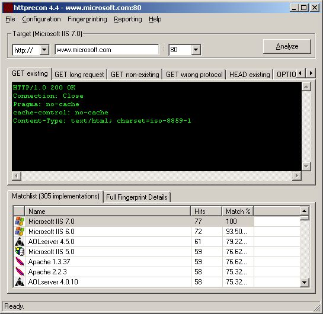



## httprecon 4\.4

### Description

httprecon provides the possibility of advanced web server fingerprinting:

http://www.computec.ch/projekte/httprecon/

Besides the well-known enumeration of http response status codes and header-ordering several other fingerprinting mechanisms were introduced. For example the capitalization of header lines, the use of spaces and the structure of ETag values (e.g. length and quotes).

There are nine test cases in which the behavior of the target service is mapped. These are:

- legitimate GET request for an existing resource

- very long GET request (&gt;1024 bytes in URI)

- common GET request for a non-existing resource

- common HEAD request for an existing resource

- allowed method enumeration with OPTIONS

- usually not permitted http method DELETE

- not defined http method TEST

- non-existing protocol version HTTP/9.8

- GET request including attack patterns (e.g. ../ and %%)

This increases the amount of fingerprints to distinguish the given implementation. Thus, the accuracy of the fingerprinting series is very high. Theoretically httprecon 1.x is able to generate approx. 198 fingerprint atoms per full scan run (usually between 80 and 120 are given). More details and a documentation is available on the project web site.

New fingerprints can be saved within the local data base. A simple flat file structure is used which introduces the possibility of manual editing and verification. There is also the possibility to suggest new fingerprints for the official repositories. Scans and the results can be exported to an XHTML 1.0 report. Other formats (TXT, CVS, XML, Word) are planned.

The current software release is written in VB6 for win32 and provided under the General Public License (GPL). Ports to other platforms (a Linux command line edition is under developement) will come. The fingerprint data base is also available on the project web site which allows the creation of statistical analysis for surveys (e.g. most common is this kind of content-type in default installation of Apache 1.2.34).

This implementation is a kind of proof-of-concept within a bigger picture: It shall be the foundation for a framework which is able to identify different services (e.g. smtp, ftp, telnet, ssh, oracle-tns, ...). The long-term goal is the developement of a very fast an reliable vulnerability scanner which combines this approach with the plugin and exploiting technique known by solutions like Nessus or ATK...

Feel free to test and use the application. A appriciate new fingerprints of course. Upload them via the built-in save &amp; submit function. Bug reports and feature requests can be sent via email to me directly. Thank you.
 
### More Info
 
There is the slight chance that the test requests might affect the target host or service (e.g. denial of service).

             |
---                |---
**Submitted On**   |2008-06-22 11:18:14
**By**             |[Marc Ruef](https://github.com/Planet-Source-Code/PSCIndex/blob/master/ByAuthor/marc-ruef.md)
**Level**          |Advanced
**User Rating**    |5.0 (10 globes from 2 users)
**Compatibility**  |VB 6\.0
**Category**       |[Internet/ HTML](https://github.com/Planet-Source-Code/PSCIndex/blob/master/ByCategory/internet-html__1-34.md)
**World**          |[Visual Basic](https://github.com/Planet-Source-Code/PSCIndex/blob/master/ByWorld/visual-basic.md)
**Archive File**   |[httprecon\_2117796222008\.zip](https://github.com/Planet-Source-Code/marc-ruef-httprecon-4-4__1-70735/archive/master.zip)

